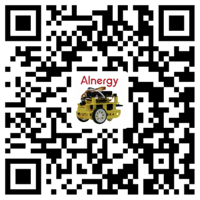

# Ascbot 智能小车的世界
欢迎来到Ascbot智能小车的世界，现在我们可以用Ascbot开启一段愉快的AI学习之旅！
## 开始
按照以下步骤，我们就可以组装一辆Ascbot智能小车，并构建一个完整的AI项目

1. 先从[淘宝](https://item.taobao.com/item.htm?id=605273577157)购买Ascbot智能小车

2. 依照[Ascbot智能小车组装指南](./Docs/Ascbot-assembly-guide-cn.md)组装小车
3. 依照[Ascbot智能小车系统制作指南](./Docs/Ascbot-system-install-guide.md)创建系统SD卡
4. 依照[Ascbot智能小车开机运行指南](./Docs/Ascbot-system-startup.md)启动小车
5. 依照[Ascbot智能小车开发环境搭建指南](./Docs/Ascbot-Development-environment-guide.md)搭建开发环境
6. 依照以下文档开发AI算法
    * [Ascbot智能小车车道线检测算法开发指南](./Docs/Ascbot-Lane_Detection-Algorithm-Development-Guide.md)
    * [Ascbot智能小车防碰撞及防跌落算法开发指南](./Docs/Ascbot-Anti-collision_anti-drop-algorithm-development-guide.md)
    * [Ascbot智能小车车道线检测算法API清单](./Docs/Ascbot-Lane_Detection-Algorithm-API-list.md)
    * [Ascbot智能小车防碰撞及防跌落算法API清单](./Docs/Ascbot-Anti-collision_anti-drop-algorithm-API-list.md)
7. 依照[Ascbot智能小车系统开发指南](./Docs/Ascbot-system-develop-guide.md)开发小车控制应用

