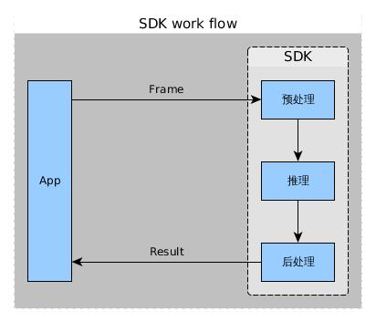

# 防碰撞&防跌落算法API清单
+ 接口简介
+ 算法工作流程
+ 接口说明
+ 数据类型
+ 编译方法
+ 示例

## 接口简介
+ 防碰撞检测算法SDK是对防碰撞算法进行了封装，提供了简单的API接口，方便用户调用、并快速集成开发基于防碰撞的算法的应用。
+ 防跌落检测算法SDK是对目标检测算法进行了封装，提供了简单的API接口，方便用户调用、并快速集成开发基于防跌落的算法的应用。

## 算法工作流程

+ 目前支持的输入图像格式是YUV420。
+ 预处理中包含图像缩放、格式转换、归一化等。
+ 后处理包含算法推理结果的变换等。
+ SDK使用方法（调用流程）请参考示例代码。

## 接口说明
### 防碰撞算法
#### API列表
函数|参数|返回值|说明
--|:--:|:--:|:--:
HiRoadObjectFollowing|无|无|构造函数
~HiRoadObjectFollowing|无|无|析构函数
init|std::string& config_path|bool|初始化算法
deInit|无|bool|反初始化是否成功
predict|HIImgData& frame|bool|输入推理图像，输入图像数据是YUV420格式
isInit|无|bool|是否初始化成功

#### 接口说明
---
+ 函数原型
   + bool init(const std::string& config_path);
+ 函数说明
   + 初始化算法，创建算法上下文环境。
+ 参数说明 
   + std::string& config_path : 指定配置文件road_object_following_graph.config的路径
+ 返回值说明
   + 返回值如果是true则成功，否则失败。

---
+ 函数原型
   + bool deInit();
+ 函数说明
   + 反初始化算法,销毁算法上下文环境。
+ 参数说明 
   + 无
+ 返回值说明
   + 返回值如果是true则成功，否则失败。

---
+ 函数原型
   + void setCallbackFunction(road_obj_callback_t func);
+ 函数说明
   + 指定回调函数，算法推理结果会通过回调函数通知使用者。
+ 参数说明 
   + func : 回调函数的实现,如：
```
int on_result_update(const std::vector<hi::RoadObjectData>& results) {           
   // 获取算法结果
   ......
    return 0;
}
```
+ 返回值说明
   + 无

---
+ 函数原型
   + bool isInit() const;
+ 函数说明
   + 返回算法是否已经初始化。
+ 参数说明 
   + 无
+ 返回值说明
   + 返回值如果是true则成功，否则失败。
---

### 防跌落算法
#### API列表
函数|参数|返回值|说明
--|:--:|:--:|:--:
HiCollisionAvoidance|无|无|构造函数
~HiCollisionAvoidance|无|无|析构函数
init|std::string& config_path|bool|初始化算法
deInit|无|bool|反初始化是否成功
predict|HIImgData& frame|bool|输入推理图像，输入图像数据是YUV420格式
isInit|无|bool|是否初始化成功

#### 接口说明
---
+ 函数原型
   + bool init(const std::string& config_path);
+ 函数说明
   + 初始化算法，创建算法上下文环境。
+ 参数说明 
   + std::string& config_path : 指定配置文件collision_avoidance_graph.config的路径
+ 返回值说明
   + 返回值如果是true则成功，否则失败。

---
+ 函数原型
   + bool deInit();
+ 函数说明
   + 反初始化算法,销毁算法上下文环境。
+ 参数说明 
   + 无
+ 返回值说明
   + 返回值如果是true则成功，否则失败。

---
+ 函数原型
   + void setCallbackFunction(road_obj_callback_t func);
+ 函数说明
   + 指定回调函数，算法推理结果会通过回调函数通知使用者。
+ 参数说明 
   + func : 回调函数的实现,如：
```
int on_result_update(const std::vector<hi::CollisionData>& results) {
   // 获取算法结果
   ......
    return 0;
}
```
+ 返回值说明
   + 无

---
+ 函数原型
   + bool isInit() const;
+ 函数说明
   + 返回算法是否已经初始化。
+ 参数说明 
   + 无
+ 返回值说明
   + 返回值如果是true则成功，否则失败。

## 数据类型
Hi::HIImgData
+ 功能说明
   + 输入数据结构的封装，包含图像的宽、高、类型、数据等信息。
+ 成员介绍
+ 定义原型

---
Hi::CollisionStatus
+ 功能说明
   + 定义危险或安全状态。
+ 成员介绍
+ 定义原型
```
enum CollisionStatus {
    DANGER0 = 0,  // danger0 status
    SAFE0 = 1,    // safe0 status
};
```

---
Hi::CollisionData
+ 功能说明
   + 算法返回数据结构定义，包含运行状态信息（危险或安全）。
+ 成员介绍
+ 定义原型
```
struct CollisionData {
    CollisionStatus status = CollisionStatus::SAFE0;
    /// Confidence of all the possible prediction results
    /// and all those are normalized in [0.0f, 1.0f]
    std::map<CollisionStatus, float> status_map;
    int64_t timestamp = 0;  // The input image timestamp.
};

```
---
Hi::RoadObjectData
+ 功能说明
   + 算法返回数据结构定义，包含检测到的物体位置（x,y,宽，高）、类别标签、置信度。
+ 成员介绍
+ 定义原型
```
struct RoadObjectData {
    float x = 0.0f;
    float y = 0.0f;
    float width = 0.0f;
    float height = 0.0f;
    int lable = 0;
    float confidence = 0.0f;
    int64_t timestamp = 0;  // The input image timestamp.
};
```


## 编译方法
```
./build.sh
```
编译前需要将build.sh和Makefile文件中的LD_LIBRARY_PATH和DDK_HOME路径修改为编译机器对应的DDK安装目录。
DDK安装方法可以参考[DDK 部署](https://ascend.huawei.com/doc/Atlas200DK/1.3.0.0/zh/zh-cn_topic_0195268768.html)。

## 示例
### 防碰撞算法使用示例
```
#include <unistd.h>
#include <sys/time.h>
#define __USE_XOPEN
#include <time.h>
#include "hiaiengine/ai_memory.h"
#include "HiRoadObjectFollowing.h"
#include "file_utils.h"
#include "main.h"

static const char* g_label_str[] = {"cup",   "car",  "box",  "person",     "hand",       "bottle",
                                    "phone", "book", "line", "left_round", "right_round","edge",
                                    "light"};

int64_t getCurrentTime_ms() {
    struct timeval tv;
    gettimeofday(&tv, NULL);
    return tv.tv_sec * 1000 + tv.tv_usec / 1000;
}

int on_result_update(const std::vector<hi::RoadObjectData>& results) {
    std::cout << "on_result_update size:" << results.size() << std::endl;
    int64_t time = getCurrentTime_ms();
    for (int i = 0; i < results.size(); i++) {
        const hi::RoadObjectData& object = results.at(i);
        if (object.confidence > 0.5f) {
            if (object.lable < 11) std::cout << g_label_str[object.lable] << std::endl;
            int64_t diff = time - object.timestamp;
            std::cout << "object" << i << ": lable=" << object.lable << ", box[" << object.x << ","
                      << object.y << "," << object.width << "," << object.height
                      << "] conf=" << object.confidence << ", timestamp:" << object.timestamp
                      << ",time=" << diff << std::endl;
        }
    }
    return 0;
}

int main(int argc, char* argv[]) {
    std::cout << "main" << std::endl;
    hi::HiRoadObjectFollowing objectDetector;
    objectDetector.init(
        "/home/HwHiAiUser/HIAI_PROJECTS/workspace_mind_studio/HRobot/"
        "road_object_following_graph.config");
    objectDetector.setCallbackFunction(on_result_update);

    std::string file =
        "/home/HwHiAiUser/HIAI_PROJECTS/workspace_mind_studio/HRobot/"
        "1920_1280_bin.bin";
    uint32_t file_width = 1920;
    uint32_t file_height = 1080;
    uint32_t file_size = 3133440;
    uint8_t* imageBufferPtr = NULL;
    // run on same side with dvpp need to make the mem align to 128(dvpp need)
    imageBufferPtr = reinterpret_cast<uint8_t*>(memalign(128, file_size));

    utils_GetImageBuffer(file.c_str(), imageBufferPtr, file_size, 0);
    int iter = 50000;
    while (iter-- > 0 || true) {
        std::cout << "times: " << iter << std::endl;
        int64_t time = getCurrentTime_ms();
        hi::HIImgData image(file_width, file_height, TYPE_YUV_NV12, imageBufferPtr, file_width,
            time);
        objectDetector.predict(image);
        std::cout << "main predict finish" << std::endl;
        usleep(30000);
    }

    objectDetector.deInit();

    std::cout << "finish!!!" << std::endl;
    return 1;
}
```
### 防跌落算法使用示例
```
#include <unistd.h>
#include "hiaiengine/ai_memory.h"
#include "HiCollisionAvoidance.h"
#include "file_utils.h"
#include "main.h"

int on_result_update(const std::vector<hi::CollisionData>& results) {
    std::cout << "on_result_update size:" << results.size() << std::endl;
    for (int i = 0; i < results.size(); i++) {
        const hi::CollisionData& coll = results.at(i);
        std::cout << "coll status:" << coll.status << std::endl;
        for (std::map<hi::CollisionStatus, float>::const_iterator iter = coll.status_map.begin();
             iter != coll.status_map.end(); iter++) {
            std::cout << iter->first << "->" << iter->second << std::endl;
        }
        std::cout << "timestamp:" << coll.timestamp << std::endl;
    }
    return 0;
}

int main(int argc, char* argv[]) {
    std::cout << "main" << std::endl;
    hi::HiCollisionAvoidance roadDetector;
    roadDetector.init(
        "/home/HwHiAiUser/HIAI_PROJECTS/workspace_mind_studio/HRobot/"
        "collision_avoidance_graph.config");
    roadDetector.setCallbackFunction(on_result_update);

    std::string file =
        "/home/HwHiAiUser/HIAI_PROJECTS/workspace_mind_studio/HRobot/"
        "light_danger0_13dis_right4_60_0_22_dark_yuv.bin";
    uint32_t file_width = 1280;
    uint32_t file_height = 720;
    uint32_t file_size = 1382400;
    uint8_t* imageBufferPtr = NULL;
    // run on same side with dvpp need to make the mem align to 128(dvpp need)
    imageBufferPtr = reinterpret_cast<uint8_t*>(memalign(128, file_size));

    utils_GetImageBuffer(file.c_str(), imageBufferPtr, file_size, 0);
    hi::HIImgData image(file_width, file_height, TYPE_YUV_NV12, imageBufferPtr, file_width,
                        2231234);
    int iter = 5;
    while (iter-- > 0) {
        std::cout << "times: " << iter << std::endl;
        roadDetector.predict(image);
        std::cout << "main predict finish" << std::endl;
        usleep(30000);
    }

    roadDetector.deInit();

    std::cout << "finish!!!" << std::endl;
    return 1;
}
```
