# 第一部分：综述

## 1.总装图

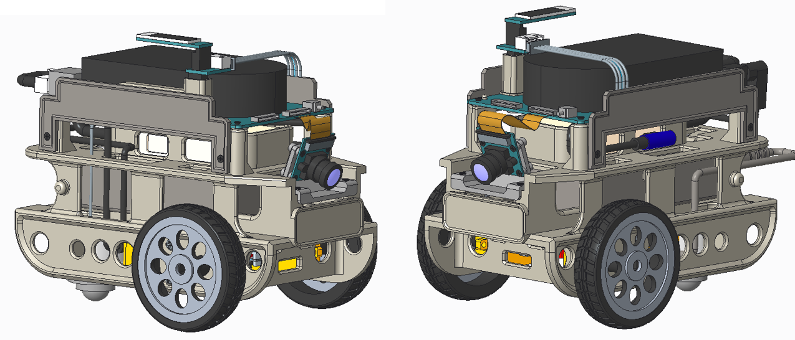

## 2.总装爆炸图

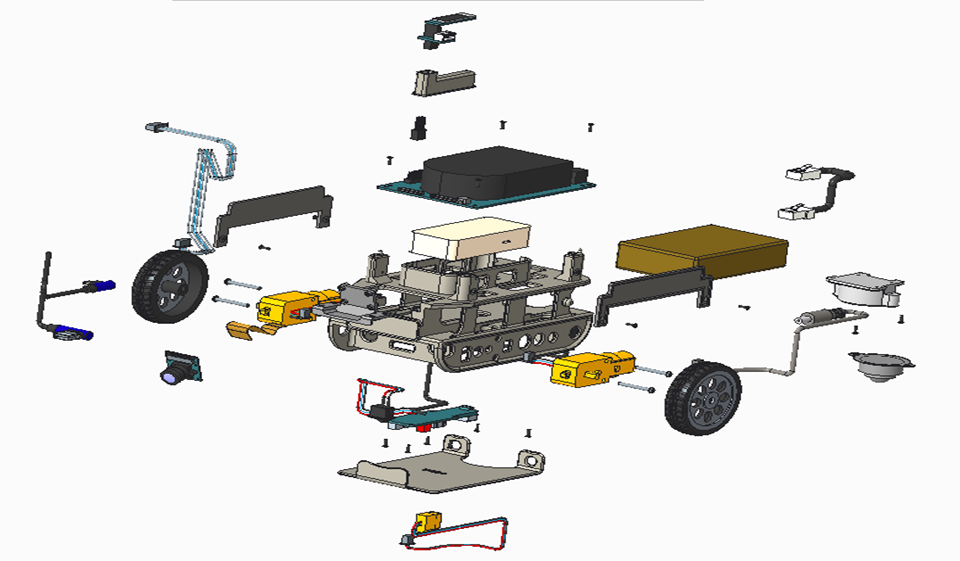

## 3.零件清单列表

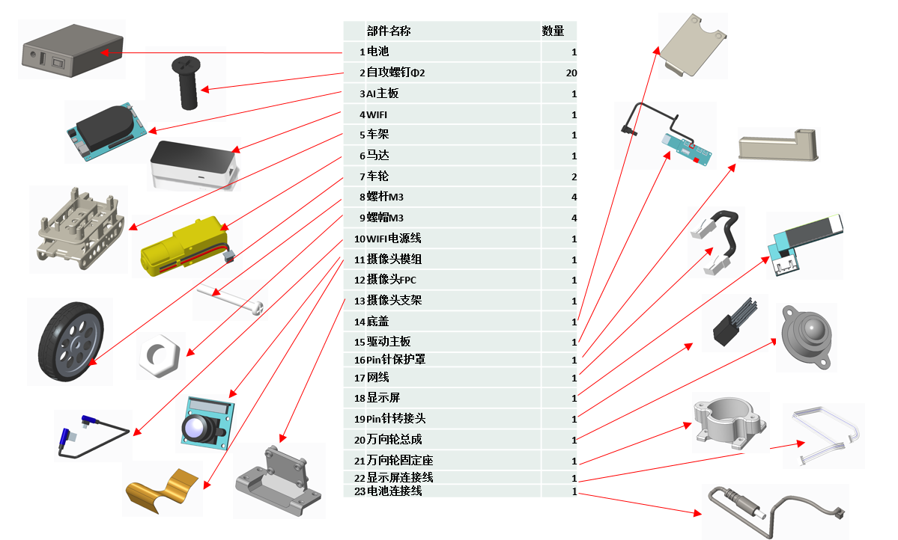

# 第二部分：整机组装

## 1.马达组装

第一步：将马达按图1方向放置到车架位置；

第二步：按顺序，将螺杆按图2从车架外部穿入车架及马达，与马达内侧螺帽扭紧.

第三步：将马达按图3方向放置到车架位置；
第四步：将顺序，将螺杆按图4从车架外部穿入车架及马达，与马达内侧螺帽扭紧.

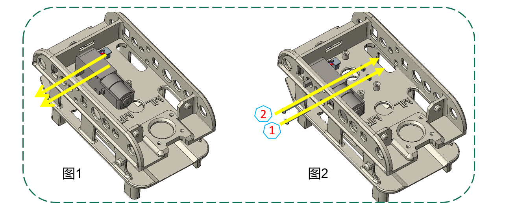

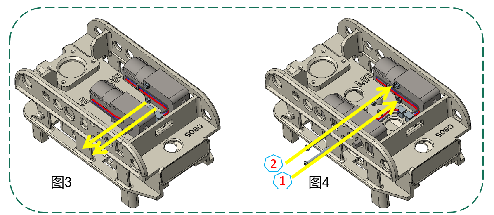

## 2.驱动主板组装

第一步：将主板上的电源线插头从图1所示位置穿过车架，按图示方向将主板放到车架固定柱上；
第二步：按图2顺序，用螺钉x4将主板固定.
第三步：按图3所示，将马达接线插头插入对应插座中。

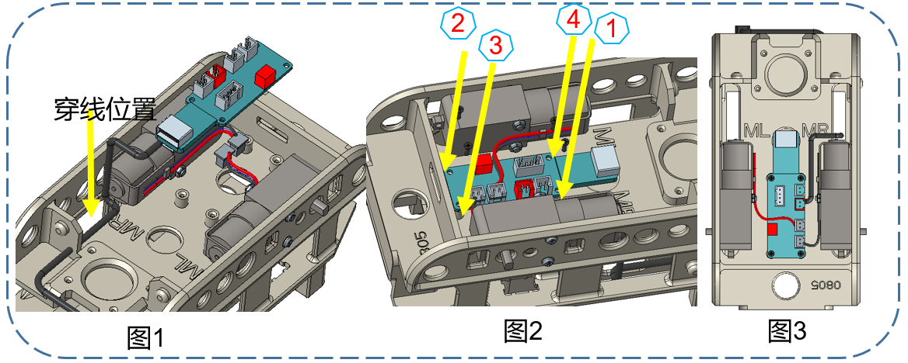

## 3.电池连接线组装

第一步：将电池连接线沿图1所示路径穿过；
第二步：按图2所示，将连线插头插入插座中。

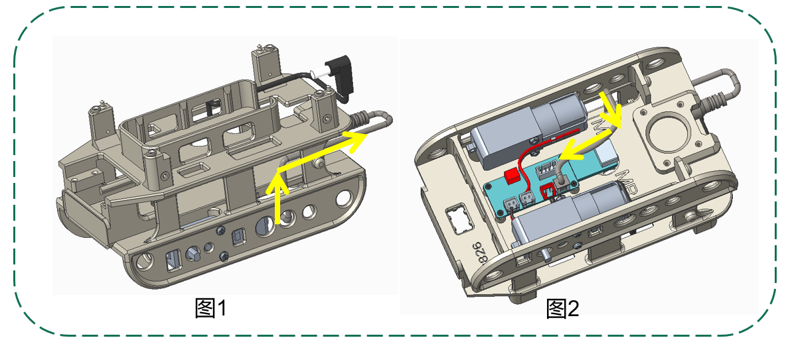

## 4.Wifi电源线的组装

第一步：将USB端插入驱动主板的USB接口，将micro USB端如图1所示穿过车架；
第二步：按图2所示，将连线放到车架上面。

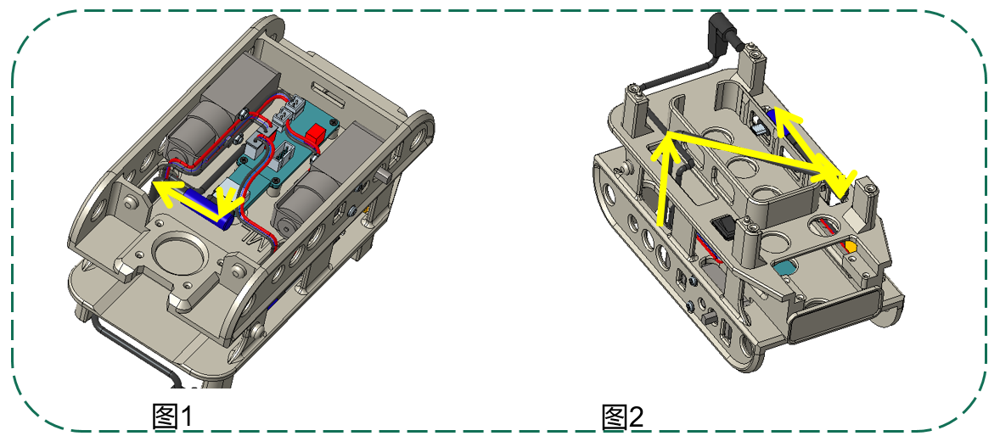

## 5.显示屏连接线组装

第一步：将显示屏连接线一端插头插入图1所示的插座，并沿图示路线穿过车架；
第二步：按图2所示，将连线放到小车上面。

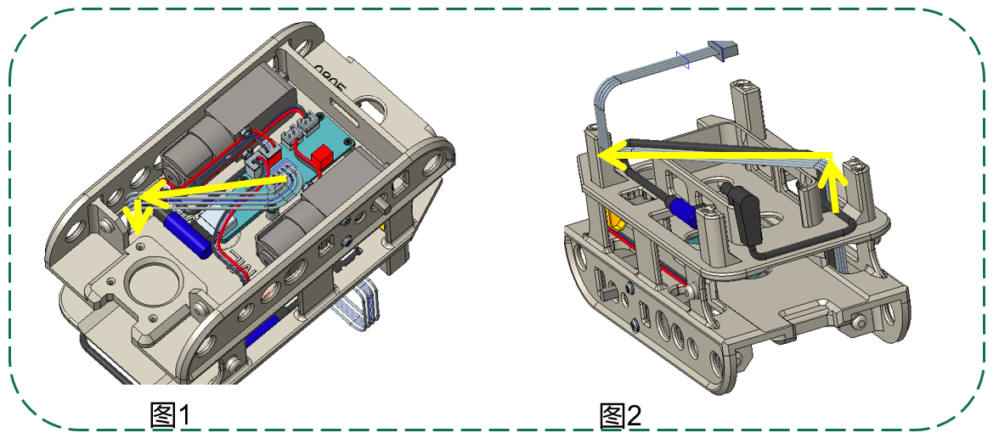

## 6.万向轮的组装

第一步：如图1所示，将万向轮底座放在槽内，用螺钉x4固定柱；
第二步：按图2所示，将万向轮总成放在万向轮底座上，用螺钉x2固定柱。

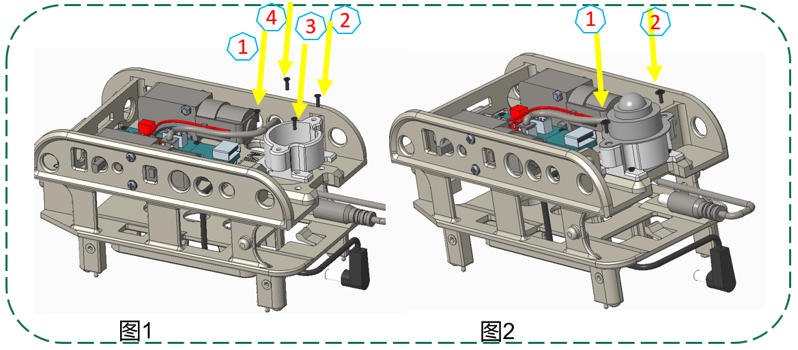

## 7.车轮的组装

第一步：如图1所示，将车轮分别装到两个马达的转轴上；

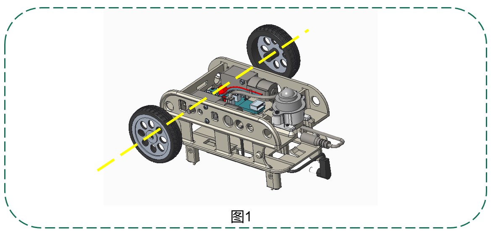

## 8.Wifi的组装

第一步：如图1所示，将Wifi的正面朝上，网口超向开口，装进框架内；
第二步：按图2所示，将Micro USB插入Wifi插口。

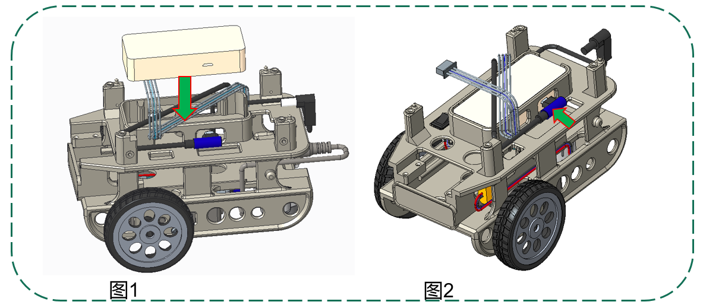

## 9.AI主板的组装

第一步：如图1所示，将AI主板放到车架上，对应凸起插入主板定位孔内；
第二步：按图2所示，用螺钉x4将AI主板固定在车架上。

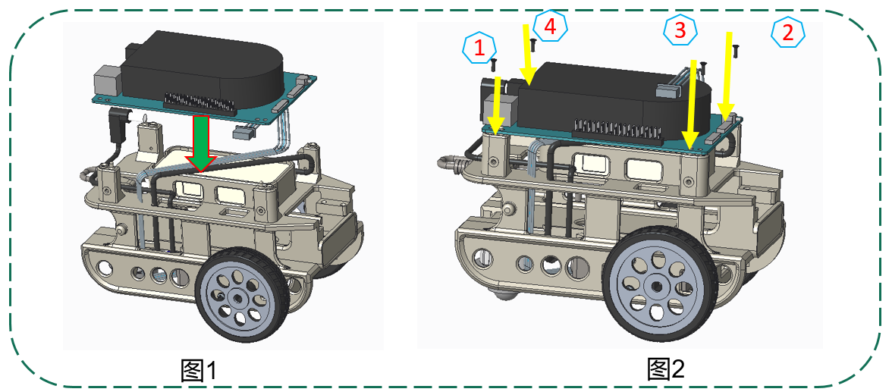

## 10.网线的组装

第一步：如图1所示，将网线接口分别插入Wifi和AI主板的网口中；
第二步：按图2所示，将网线向后折弯。

## 11.Pin针保护罩的组装

第一步：如图1所示，将Pin针保护套套在Pin针底座上；

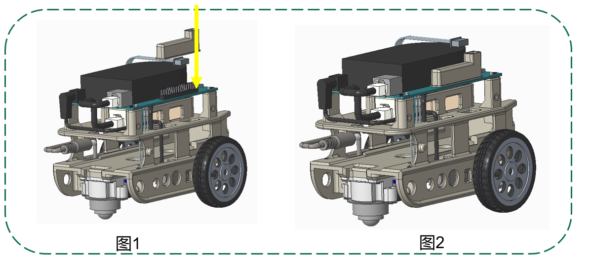

## 12.摄像头的组装

第一步：如图1所示，将摄像头FPC连接器朝外放到摄像头支架上；
第二步：按图2所示，用螺钉x4将摄像头固定到支架上。

## 13.摄像头支架的组装

第一步：如图1所示，将摄像头支架放置到车架上；
第二步：按图2所示，用螺钉x4将摄像头支架固定到车架上。

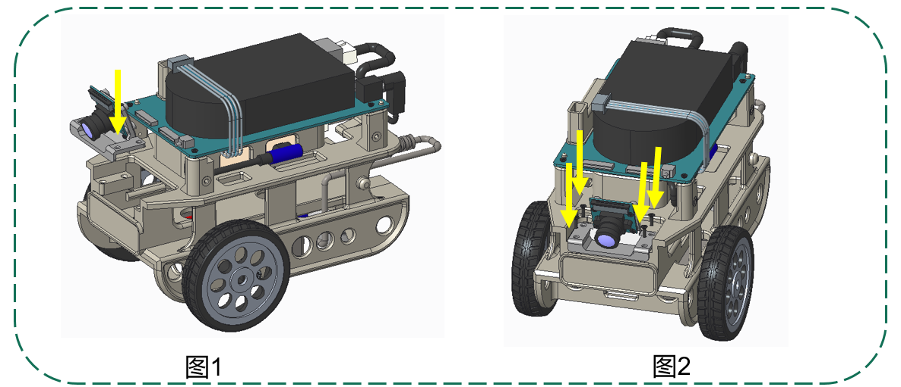

## 14.摄像头FPC的组装

第一步：如图1所示，将FPC较宽一端插入摄像头主板上的连接器中；
第二步：按图2所示，将FPC较窄一端插入到AI主板的“Camera0”连接器中。

## 15.显示屏的组装

第一步：如图1所示，将显示屏从Pin针保护罩口插到里面的Pin针上；
第二步：按图2所示，将显示屏连线插头插入显示屏的插座内。

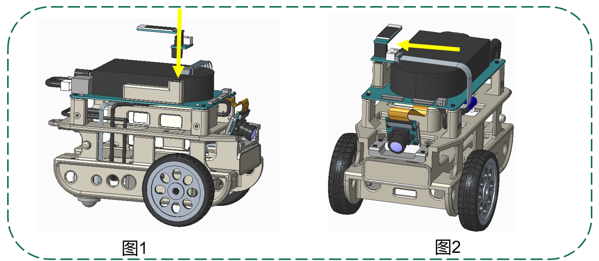

## 16.电池的组装

第一步：如图1所示，将电池推入车架中直到卡扣卡住电池；
第二步：按图2所示，将电池连接线插入电池插口。

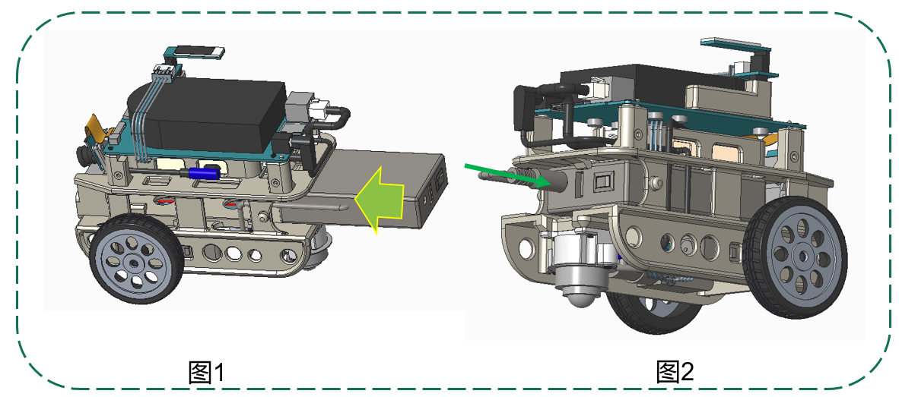

## 17.保护板的组装

第一步：如图1所示，将一侧的保护板用螺钉固定；
第二步：按图2所示，将另一侧的保护板用螺钉固定。

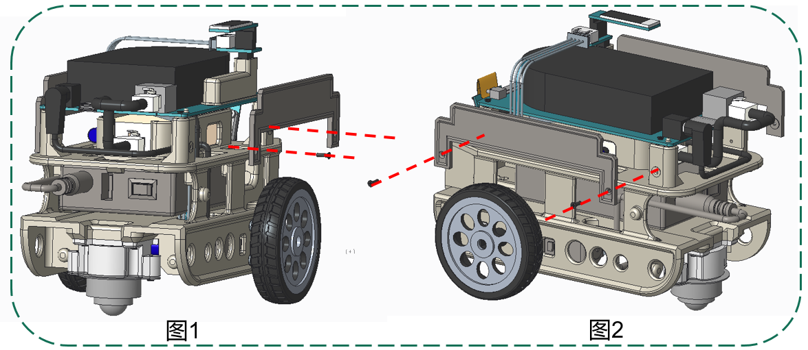
