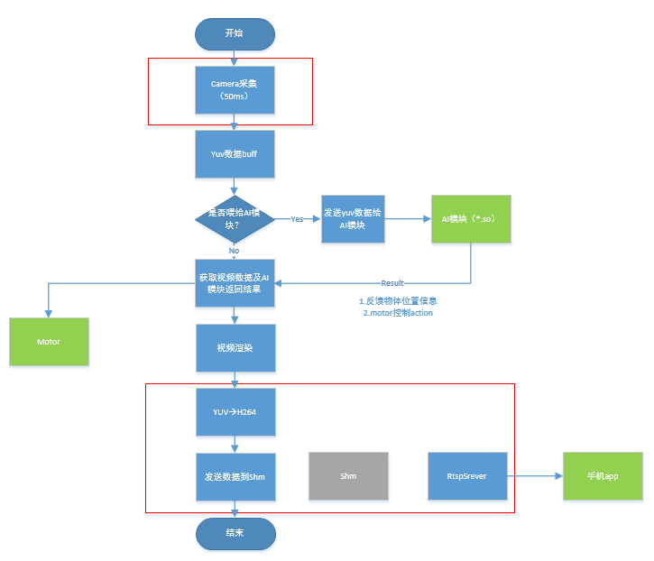

# 目录
一 系统介绍
二 Ascbot智能小车的控制
三 流媒体
四 如何循线行驶
五 如何做防碰撞以及防跌落

# 一 系统介绍
## 1 系统介绍
   Ascbot机器人是一款以Atlas 200 DK开发的机器人，利用昇腾200强大的ai算力，完成一款智能循道行驶和防碰撞还有物体跟随功能的机器人。
   现在Robot Operation  System开源机器人系统，是一款开源，非常火的机器人系统，ros系统想必大家都已经很熟悉了，由于其高度集成和封装了很多好用的应用，可以帮助我们更快更简洁的开发一款自己的机器人。ros节点之间的通信有话题和服务两种，通信的话题可以自己定义。
## 2 应用场景	
根据应用场景划分，主要分为循道行驶，防碰撞防跌落行驶和物体跟随，下面详细介绍三种应用场景。
# 二 Ascbot智能小车的控制
## 2.1 关键代码示例
###   首先导如Robot包

        from jetbot import Robot

###   创建对象

        robot = Robot()
 
 ### 调用g包内函数进行控制
 
 然后可以这个对象调用成员方法，包括左转，右转，前进，后退，停止以及单独设置指定左右轮速度，范围是-1～1，负值代表反转，正值代表正转。
        
        robot.set_motors(self, left_speed, right_speed)  #指定左轮和右轮的速度值，范围-1～1
        robot.forward( speed=1.0, duration=None)         #前进
        robot.backward( speed=1.0)                       #后退
        robot.left(speed=1.0)                            #左转
        robot.right(speed=1.0)                           #右转
        robot.stop()                                     #停止  
最基本的控制就是如上代码，再加上自己的应用场景逻辑，就可以实现自己的机器人了。
# 三 流媒体
## 3.1  视频流框架及原理
camera server及rtsp server流程框架图

camera server实现了对视频流数据的捕获，同时传输给AI算法进行处理，最后通过rtsp server以h264格式实现在手机app上播放功能。

## 3.2 camera server 交叉编译环境搭建
### 3.2.1 前提条件
安装gcc-aarch64-linux-gnu与g++-aarch64-linux-gnu（5.4.0)版本
### 3.2.2 配置交叉编译环境
请参考华为文档[交叉编译环境配置](https://ascend.huawei.com/doc/Atlas200DK/1.3.0.0/zh/zh-cn_topic_0195275737.html) 

## 3.3 camera server 代码下载
代码下载链接[camera server及rtsp server代码下载](https://gitee.com/Atlas200DK/Ascbot) 下载camera_server_release.tar.gz及rtsp_server_release.tar.gz

## 3.4 camera server编译
在PC端解压下载的camera_server_release.tar.gz生成文件夹camera_server。
```javascript
$ cd camera_server
$ make
```
```
注:编译make请先完成3.2中交叉编译环境的配置
```
即可生成可执行文件out/camera_server。

## 3.5 rtsp server编译
在PC端解压下载的rtsp_server_release.tar.gz生成rtsp_server文件夹。
```javascript
$ cd rtsp_server/live
$ ./genMakefiles HwHiAi
$ make
$ cd ..
$ make
```
即可生成可执行文件rtsp_server。

## 3.6部署安装camera server
后续操作请参考Ascbot智能小车系统安装指南。

## 3.7 camera server代码流程讲解
### 3.7.1获取camera数据
```cpp
    // get a frame from camera
    ret = s_control.camera->CaptureCameraInfo(&output_para);
    if (ret != kStreamProcessOk) {
      s_control.camera->PrintErrorInfo(ret);
    }
```
>  	通过int CaptureCameraInfo(*output_par)函数从camera获取一帧数据 参数output_para返回camera相关数据.

### 3.7.2 传送数据给算法sdk
```cpp
    hi::HIImgData image(s_control.camera_set.width, s_control.camera_set.height,
                        TYPE_YUV_NV12, s_control.camera_set.p_data, s_control.camera_set.width,timestampMicro);

    if (motor.GetMotorStatus()->roadfollowingSwitch == 1) {
      roadDetector.predict(image);
    }

    if (motor.GetMotorStatus()->collisionSwitch == 1) {
      caDetector.predict(image);
    }

    if (motor.GetMotorStatus()->objectDetectionSwitch == 1) {
      objectDetector.predict(image);
    }

    if (motor.GetMotorStatus()->roadobjectDetectionSwitch == 1) {
      roadObjectDetector.predict(image);
    }
```
> 定义hi::HIImgData格式变量image，然后通过调用如下AI函数将camera数据传给AI 模块处理：
> roadDetector.predict(image); 
>  caDetector.predict(image); 
> objectDetector.predict(image); 
>  roadObjectDetector.predict(image);

### 3.7.3 给图像做加箭头、加框处理
```cpp
    if (motor.GetMotorStatus()->roadfollowingChange == 1 && s_rf.arraw_flag == true) {
      if (motor.GetMotorStatus()->angle >= -20.0 && motor.GetMotorStatus()->angle <= 20.0) {
        DrawAngle(s_control.camera_set.p_data, s_rf.arraw[0], startMarkX,
        startMarkY, motor.GetMotorStatus()->x, motor.GetMotorStatus()->y);
      } else if (motor.GetMotorStatus()->angle >= -90.0 && motor.GetMotorStatus()->angle < -20.0) {
        DrawAngle(s_control.camera_set.p_data, s_rf.arraw[1], startMarkX, startMarkY,
        motor.GetMotorStatus()->x, motor.GetMotorStatus()->y);
      } else if (motor.GetMotorStatus()->angle > 20.0 && motor.GetMotorStatus()->angle <= 90.0) {
        DrawAngle(s_control.camera_set.p_data, s_rf.arraw[2], startMarkX, startMarkY,
        motor.GetMotorStatus()->x, motor.GetMotorStatus()->y);
      } else {
        printf("[%s] angle out angle:%d x:%d y:%d  \n",__func__ ,
        motor.GetMotorStatus()->angle,  motor.GetMotorStatus()->x, motor.GetMotorStatus()->y);
      }
      motor.GetMotorStatus()->roadfollowingChange = 0;
    }
```
```cpp
    if (motor.GetMotorStatus()->objectDetectionChange == 1) {
      DrawBox(s_control.camera_set.p_data);
      motor.GetMotorStatus()->objectDetectionChange = 0;
    }

    if (motor.GetMotorStatus()->roadObjectDetectionChange == 1) {
      DrawBox(s_control.camera_set.p_data);
      motor.GetMotorStatus()->roadObjectDetectionChange = 0;
    }
```
> 结合算法处理的结果对获取的图像进行处理，
调用DrawBox对识别的物体加框、调用DrawAngle对前进方向预测加箭头等处理

### 3.7.4 图像压缩编码成h264视频

```cpp
unsigned char* p_read = p_stream->s_control.frame_process->get_read_buff(kYuvImageSize);
        if(p_read == NULL) {
          p_stream->s_control.frame_process->DeQueue(p_stream->s_control.camera_set.yuvData,kYuvImageSize);
          ret = p_stream->s_control.dvpp_process->DvppOperationProc(
            reinterpret_cast<char*>(p_stream->s_control.camera_set.yuvData), kYuvImageSize, &dvpp_output);
        } else {
            ret = p_stream->s_control.dvpp_process->DvppOperationProc(  // DVPP convert to jpg or h264
              reinterpret_cast<char*>(p_read) , kYuvImageSize, &dvpp_output);
            p_stream->s_control.frame_process->read_clear(kYuvImageSize);
        }
```

> 调用DvppOperatationProc函数将camera获取的yuv420图像转换为h264格式

### 3.7.5 得到的h264视频发送给rtsp服务器
```cpp
        if (ret == kStreamProcessOk) {
            // printf("[%s] frame dvpp size:%d \n",__func__,dvpp_output.size);
          if (p_stream->s_control.frame_out != NULL) {
            p_stream->s_control.frame_out->EnQueue(dvpp_output.buffer, dvpp_output.size);
          }    
        }
```
> 调用EnQueue函数往缓冲区中添加数据输出

### 3.7.6 rtsp服务器功能
实现h264视频文件编码和播放功能。 

## 3.8camera server相关交互接口说明

### 3.8.1 AI算法sdk交互接口
```cpp
hi::HiRoadFollowing roadDetector;
hi::HiCollisionAvoidance caDetector;
hi::HiObjectFollowing objectDetector;
hi::HiRoadObjectFollowing roadObjectDetector;
```
```cpp
  roadDetector.deInit();
  caDetector.deInit();
  objectDetector.deInit();
  roadObjectDetector.deInit();
```
```cpp
  roadDetector.init("/home/HwHiAiUser/HIAI_PROJECTS/ascend_workspace/cameraservice/road_following_graph.config");
  roadDetector.setCallbackFunction(OnResultRoadFollowing);

  caDetector.init("/home/HwHiAiUser/HIAI_PROJECTS/ascend_workspace/cameraservice/collision_avoidance_graph.config");
  caDetector.setCallbackFunction(OnResultCollisionAvoidance);

  objectDetector.init("/home/HwHiAiUser/HIAI_PROJECTS/ascend_workspace/cameraservice/object_following_graph.config");
  objectDetector.setCallbackFunction(OnResultObjectFollowing);

  roadObjectDetector.init("/home/HwHiAiUser/HIAI_PROJECTS/ascend_workspace"
                          "/cameraservice/road_object_following_graph.config");
  roadObjectDetector.setCallbackFunction(OnResultRoadObjectFollowing);
```
### 3.8.2RTSP交互接口

```cpp
if (p_stream->s_control.frame_out != NULL) {
      p_stream->s_control.frame_out->EnQueue(dvpp_output.buffer, dvpp_output.size);
} 
```

> 将通过DVPP转换成h264的视频流通过环型buffer接口传输给rtsp server，
Rtsp server然后将数据发送给播放器。


# 四 循道行驶

### 1 工作机制
从系统框图分析，cameraservice主要完成了打开camera，调用算法sdk，视频yuv数据喂给算法，利用定时器打开算法开关，定时取出算法返回的结果，循道行驶打开线性回归还有ssid壁障的结果，线性回归返回车道线的虚线与视频底边的夹角，ssid返回安全与非安全，行驶根据角度，动态调整两个电机的速度，在行驶的过程中，根据安全与非安全，判断是否停止运动。
### 2 接口说明
首先打开算法线性回归和ssid的开关

        memset(shm_addr+1*4,1,1)            #out_roadfollowingSwitch
        memset(shm_addr+2*4,0,1)           #out_collisionSwitch
        memset(shm_addr+3*4,0,1)           #out_objectDetectionSwitch    
        memset(shm_addr+4*4,1,1)           #out_roadobjectDetecttionSwitch   
 获取返回的结果
 
 
     changeStatus =  struct.unpack('iiii', string_at(shm_addr+5*4,4*4))
     angle_x_y =  struct.unpack('iii', string_at(shm_addr+9*4,3*4))
     collisionStatus =  struct.unpack('i', string_at(shm_addr+12*4,4))
     motor_angle_RunStatus =  struct.unpack('ii', string_at(shm_addr+13*4,2*4))
     objNum = struct.unpack('i', string_at(shm_addr+15*4,4))
        if objNum[0] >=1 :
          for i in range(0,objNum[0]):
             objectData =  struct.unpack('iiiiif', string_at(shm_addr+16*4+i*24,24))
        if motor_angle_RunStatus[1] == 0  :   # todo: this value has to be modified after wandering training
        ## not safe
             self.robot.set_motors(0, 0)
        else:
            angleData = angle_x_y[0] #bytearray(string_at(shm_addr+4,4))    
            self.execute(angleData)
 由于python实现的motor，cameraservice的实现是由C++实现的，所以python调用C++的实现，请自行查阅，这里不再详述。motor_angle_RunStatus数组的首个元素是安全与非安全，非安全，两个电机的速度为0；安全，把角度当作形参传递给execute。
 # 3 实现策略
     
        speed_gain_slider = 0.4                #设定速度值   
        steering_gain_slider = 0.4             #转向增益
        speed_slider = 0.2                     #初始速度值
        steering_dgain_slider = 0.4            #转向增益的斜率
        steering_bias_slider = 0.01            #转向增益

   根据以上设定的初始值，，根据公式


        speed_slider = self.speed_gain_slider
        angle = change/100.00
        pid = angle * self.steering_gain_slider + (angle - angle_last) * self.steering_dgain_slider
        angle_last = angle
        steering_slider = pid + self.steering_bias_slider
        self.robot.left_motor.value = max(min(self.speed_slider+ steering_slider, 1.0), 0.000)
        self.robot.right_motor.value = max(min(self.speed_slider - steering_slider, 1.0), 0.000)
可动态调整两个motor的速度值

# 五 防碰撞防跌落行驶
## 5.1工作机制
 从系统框图得知，cameraservice打开camera，获取的视频yuv原始数据，喂给算法sdk，通过算法开关，打开目标检测算法和边沿检测算法，算法返回是否到边沿，根据是否到边沿，进行分开处理，首先判断边沿，然后在非边沿的情况下，利用目标检测算法判断是否有非安全障碍物，检测到在有效的距离里内是否是非安全，安全不处理，继续前进；非安全，左转或者右转弯。
## 5.2 接口说明
首先打开算法目标检测和边沿检测的开关


        memset(shm_addr+1*4,0,1)            #out_roadfollowingSwitch
        memset(shm_addr+2*4,1,1)           #out_collisionSwitch
        memset(shm_addr+3*4,0,1)           #out_objectDetectionSwitch    
        memset(shm_addr+4*4,1,1)           #out_roadobjectDetecttionSwitch   
## 5.3实现策略

        changeStatus =  struct.unpack('iiii', string_at(shm_addr+5*4,4*4))
        angle_x_y =  struct.unpack('iii', string_at(shm_addr+9*4,3*4))
        collisionStatus =  struct.unpack('i', string_at(shm_addr+12*4,4))
        motor_angle_RunStatus =  struct.unpack('ii', string_at(shm_addr+13*4,2*4))
        objNum = struct.unpack('i', string_at(shm_addr+15*4,4))
        if objNum[0] >=1 :
           for i in range(0,objNum[0]):
               objectData =  struct.unpack('iiiiif', string_at(shm_addr+16*4+i*24,24))
        if collisionStatus[0] == 1 :
            if motor_angle_RunStatus[0] == -90 :
                self.robot.set_motors(-0.4, 0.4)
            elif motor_angle_RunStatus[0] == 90 :   # todo: this value has to be modified after wandering training
            # if it is not safe, whether is 
                self.robot.set_motors(0.4, -0.4)
            else:
                self.robot.set_motors(0.4, 0.4)
        else :
                self.robot.set_motors(0.4, -0.4)
collisionStatus[0]数组判别是否在有效的距离内有障碍物，根据motor_angle_RunStatus[0]的两种状态(-90左转，90右转)判别是否到了边沿。
## 5.4 日志模块
此模块订阅robot_log话题，通信的消息是Hrobotlog，此消息是自定义类型的消息，数据结构为
float64 time        //log的时间戳
string tag             //log的标识
string function //函数名称
int16 line              //行号
int8 level              //log级别
string description//描述
log的日志级别分为5个等级，包含是CRASH(0)，ERROR(1)，WARN(2)，INFO(3)，DEBUG(4)，TRACE(5)，默认值是INFO，要想修改此值，可通过1.3.3 ap交互模块在初始化的时候，指定log的日志的名字和日志级别；日志本地文件大于50M，从文件开始覆盖写入。

## 5.5 注意事项和调试说明
1 在开发板已经上电的情况下，道题尽量不要接触板子上的元器件，以免烧坏开发板；
2在插oled板子的时候，注意管教顺序，在上电之前，用万用表测量一下对应管脚的通断；
3 在开发应用的过程中，在工作空间中，创建功能包时，务必先source一下对应的setup.bash，目的是功能包添加到环境变量中；
# 六 远程控制开发接口
## 6.1 场景切换

名称 | 数据格式 |描述
-|-|
URL|192.168.3.9|ascbot的智能小车的ip
支持格式 | JSON | json字符串
请求方式 | socket| tcp通信
请求参数 | ch_mode ，mode| ch_mode:ch_mode，mode:0//防碰撞和防跌落；mode:1//循道行驶;mode:2//物体跟随；mode:3//远程遥控

## 6.2 远程遥控
名称 | 数据格式 |描述
-|-|
URL|192.168.3.9|ascbot的智能小车的ip
支持格式 | JSON | json字符串
请求方式 | socket| tcp通信
请求参数 | direction ，leftspeed，rightspeed| direction：w前进，a左转，s停止，x后退，d右转，
