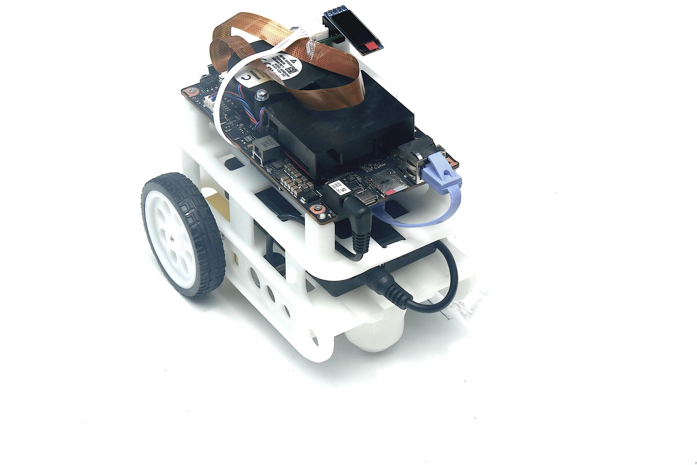
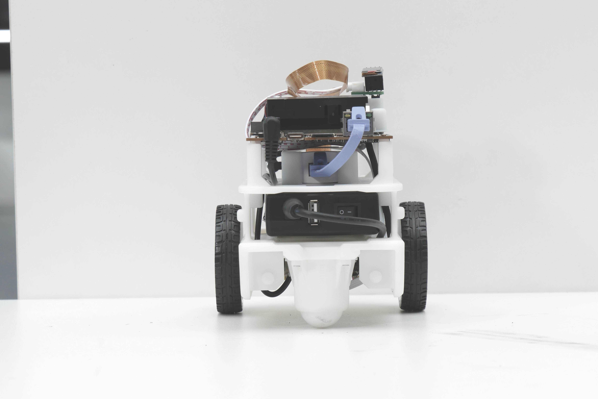
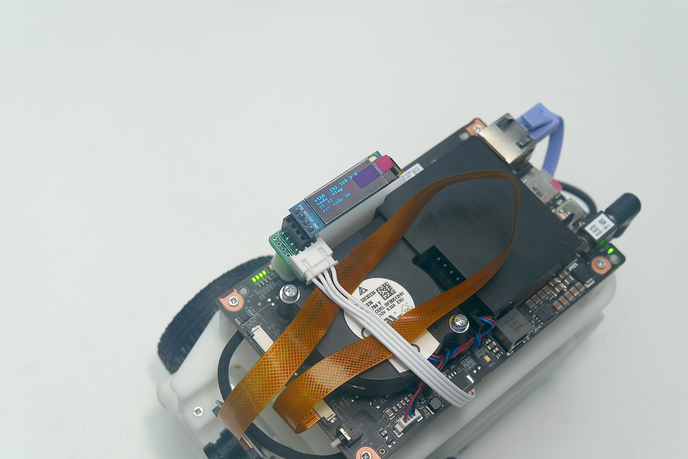
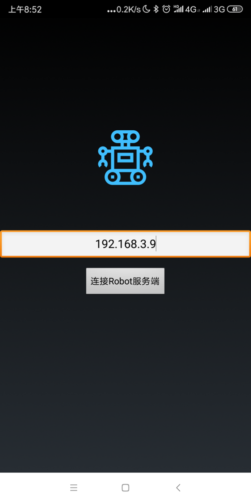
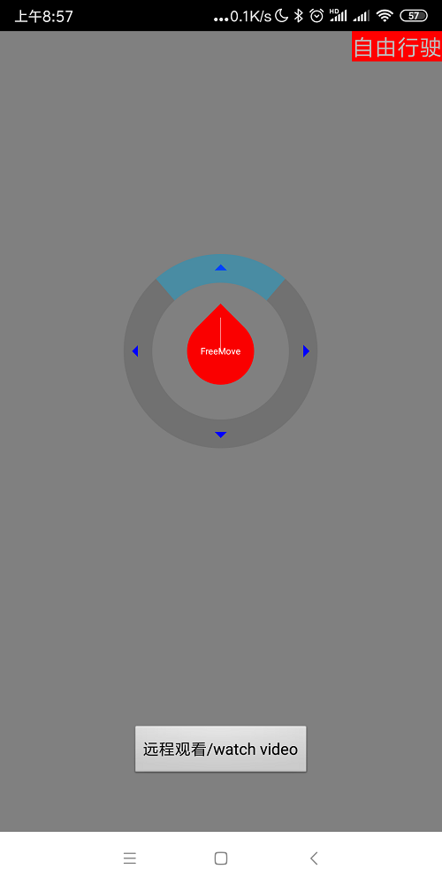
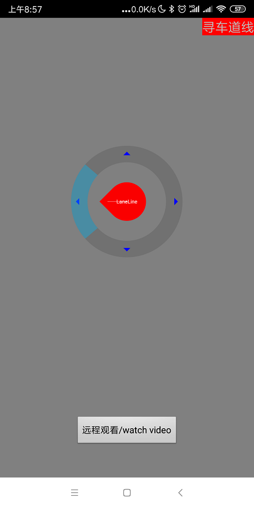
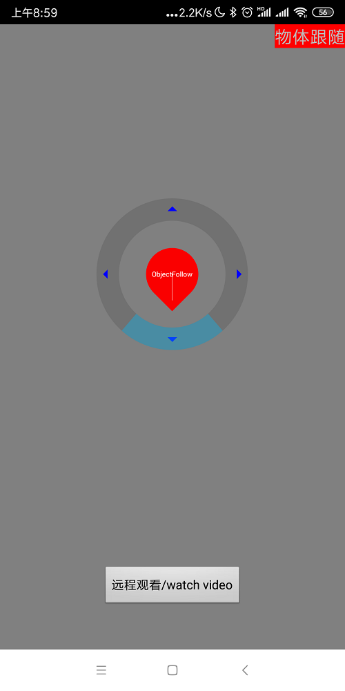
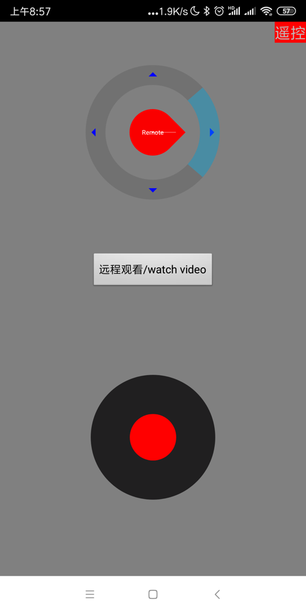
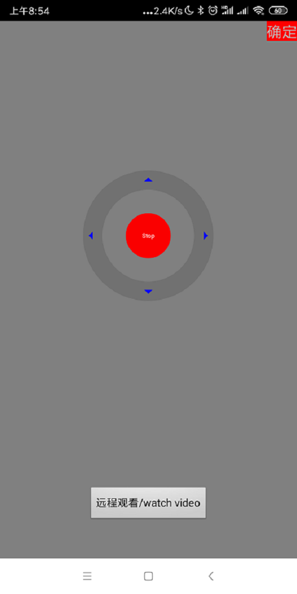
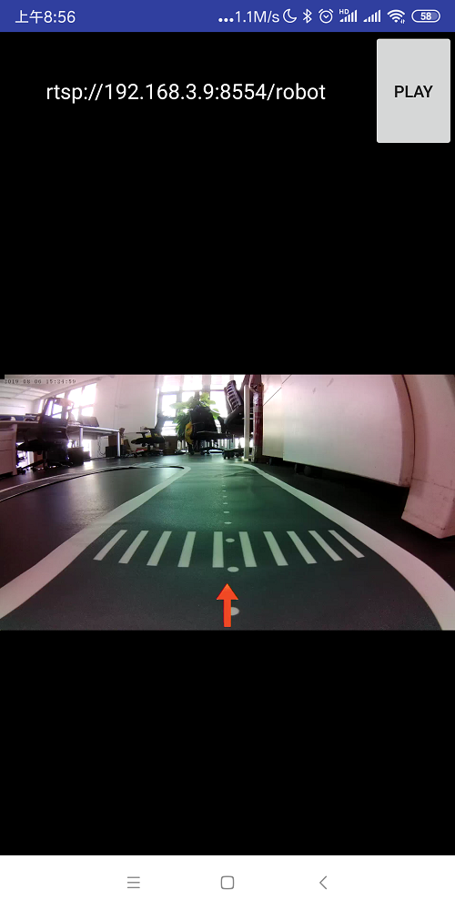

# 1. 开机前准备和检查

+ 小车的所有组件是否都正常安装没有缺失和松动
+ 所有连接线是否都正常链接没有松动或者脱落。
+ 小车电池电量是否充足
+ 小车系统SD卡准备妥当

# 2. 开机

### （1）插入SD卡

### （2）插入电池，连接电池

### （3）按下小车电池上开机键静待至小车系统LED灯全部亮起

### （4）安卓手机连接小车WiFi（HUAWEI-ABCDEF）
   注：ABCDEF是路由器的MAC地址后六位。

### （5）下载手机端控制应用ascbot-remotectrl.apk ， [下载地址](https://gitee.com/Atlas200DK/Ascbot/raw/master/Release/ascbot-remotectrlv1.0.apk)

### （6）启动APP，输入小车对应IP地址（如：192.168.3.9）后点击连接Robot服务端

# 3.模式设置

 APP上可设置不同模式：自由行驶模式、寻车道线模式、物体跟随模式以及遥控模式
 
### （1）点击上方的按钮，切换至自由行驶模式。小车运行防跌落、防碰撞

### （2）点击左侧按钮，切换至循线行驶模式模式。

### （3）点击下方按钮，切换至物体跟随模式。小车跟随指定物体行进

### （4）点击右侧按钮，小车切换至遥控模式。

### （5）点击中间红色按钮，小车停止运行，回到待机模式。

### （6）手机端点击“远程观看/watch video”，点击PLAY，观看拍摄视频流。

