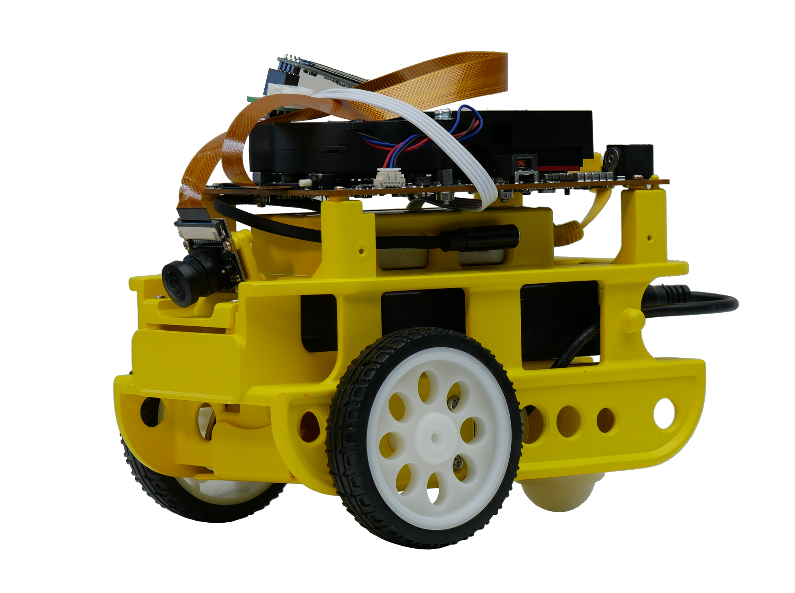

# Ascbot
Ascbot是一款面向人工智能及机器人爱好者的开源智能机器人小车，同时也是一个开放的人工智能及机器人开发平台，它具备如下特性：
- 高性能：基于华为Atlas 200 DK，提供8TOPS@FP16的算力
- 易学习：从AI算法到应用均提供完整开发教程及示例代码
- 易上手：开放的硬件清单和搭建教程，开发者可自行动手组装扩展

使用Ascbot，学习开发一个完整的AI项目或者是搭建自己的第一辆智能小车，

可以从[Ascbot Getting Start](./Ascbot_getting-start-wiki.md)开始

